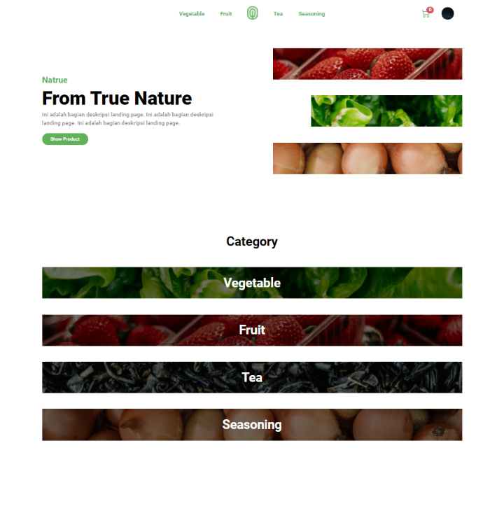
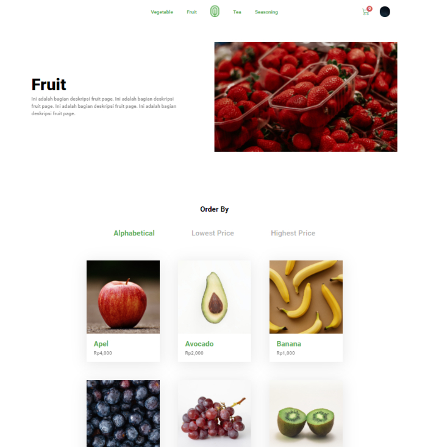
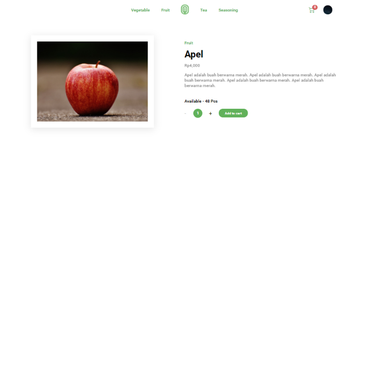
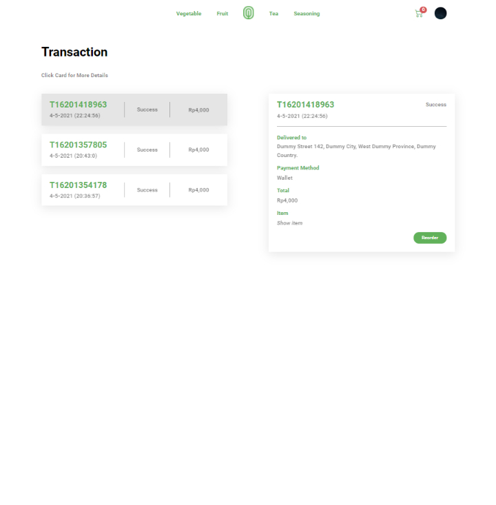

# Natrue

## About
### EN
Natrue is a simple fictional e-commerce web project that focuses on selling "nature" goods such as vegetables, fruit and others. Natrue is built using React.js for the frontend and Node.js for the backend. For the database, Natrue uses MySQL (RDBMS) and uses Sequelize as ORM.

### ID
Natrue merupakan proyek web e-commerce fiktif sederhana yang berfokus pada menjual barang-barang "alam" seperti sayur, buah dan yang lainnya. Natrue dibuat menggunakan React.js untuk frontend dan Node.js untuk backend. Untuk database, Natrue menggunakan MySQL (RDBMS) dan menggunakan Sequelize sebagai ORM.

## Project Specification
### Frontend:
- React.js
### Backend:
- Node.js
- Express.js
- MySQL (Database)
- Sequelize (ORM)

## Installation and Configuration
### Database (Backend)
- From root, go to `database` folder

      cd database
    
- Import `natrue_db.sql` database (MySQL)
- Please import this database with the same name (`natrue_db`)

### API (Backend)
#### Install API
- From root, go to `api` folder

      cd api
      
- Install the API

      npm i
    
#### Setting database connection

- Go to `dbCon` folder

      cd dbCon
      
- Open `index.js` file, look at `line 3`, change `"username"` and `"password"` to your MySQL username and password

      const dbCon = new Sequelize("natrue_db", "yourUsername", "yourPassword", {
	      host: "127.0.0.1",
	      dialect: "mysql",
      });

#### Run the API

- Move (back) from `dbCon` folder, to `api` folder

      cd ..
      
- Start the API

      node .

### Client (Frontend)

- From root, go to `client` folder

      cd client
      
- Install the Client

      npm i

- And then start

      npm start
      
### Final Step

- Open `localhost:3000` in your browser
- Happy "shopping"

## Screenshot
### Landing Page

### Product Feed Page

### Product Detail Page

### Cart Page

### Transaction Page

## Important Notice
### EN
NATRUE IS JUST A FICTIONAL E-COMMERCE THAT I CREATED FOR MY PERSONAL PORTFOLIO. ANYTHING THAT IS STATED "FOR SALE" HERE IS NOT ACTUALLY SOLD BY ME. THE PRICES OF GOODS LISTED MAY ALSO DIFFER FROM THE ACTUAL MARKET PRICES.

### ID
NATRUE HANYALAH E-COMMERCE FIKTIF YANG SAYA BUAT UNTUK PORTFOLIO PRIBADI SAYA. SEMUA BARANG YANG DINYATAKAN "DIJUAL" DI SINI TIDAK BENAR-BENAR SAYA JUAL. HARGA BARANG YANG TERTERA JUGA MUNGKIN BERBEDA DENGAN HARGA PASAR SEBENARNYA.

## License
[SEE LICENSE](https://github.com/luthfirobbaniy/Natrue/blob/main/LICENSE)
